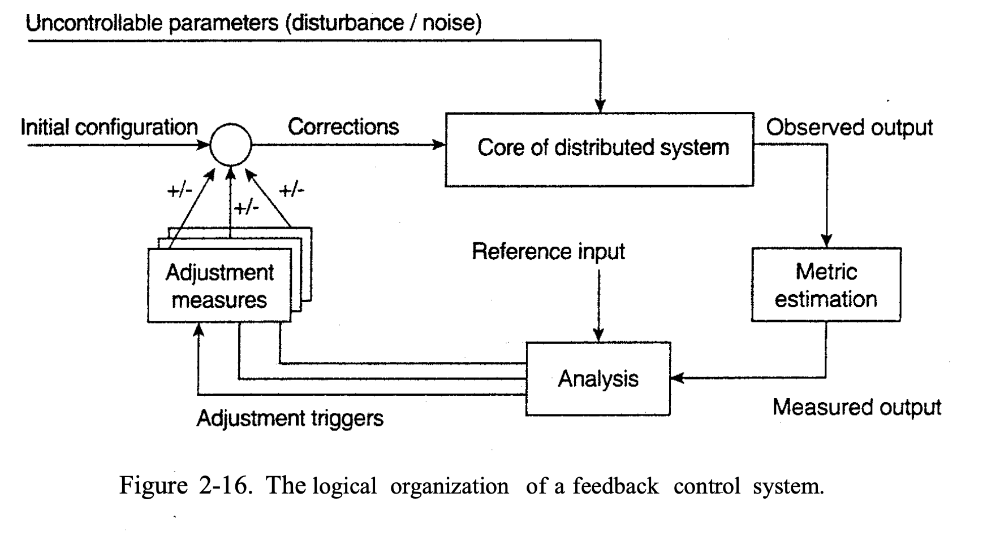
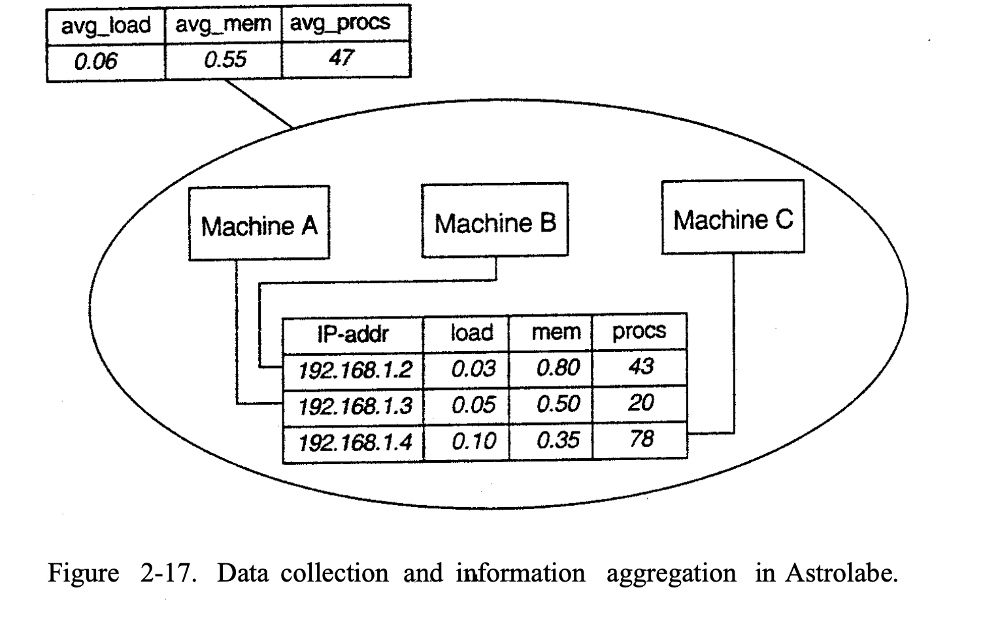
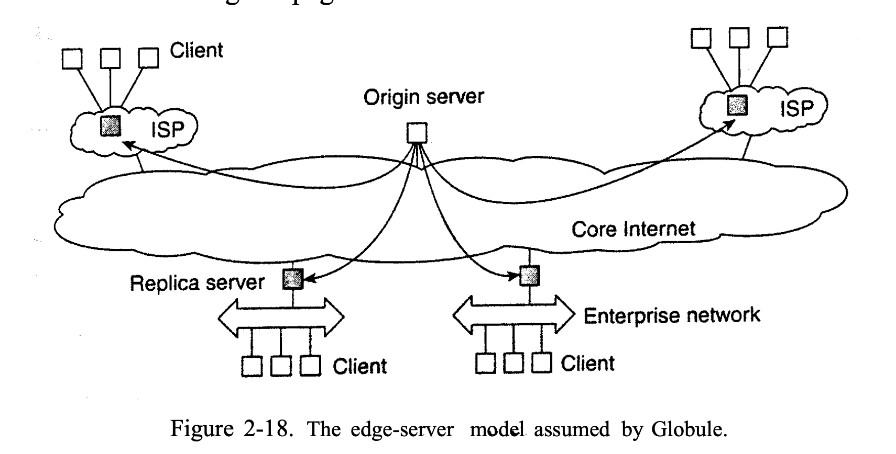

# Distributed System Architectures

We will first pay attention to some commonlly applied approaches toward organizing distributed systems.

## 1. ARCHITECTURAL STYLES

1. Layered architectures
2. Object-based architectures 
3. Data-centered architectures 
4. Event-based architectures

## 2. SYSTEM ARCHITECTURES

#### 2.1 Centralized Architectures

Application Layering：

1. The user-interface level
    - The user-interface level contains all that is necessary to directly interface with the user, such as display management. 
2. The processing level
    - The processing level typically contains the ap- plications.
3. The data level
    - The data level manages the actual data that is being acted on.

This is a a three-tiered architecture.

#### 2.2 Decentralized Architectures

1. Peer-to-Peer Architectures：
    - In a structured peer-to-peer architecture, the overlay network(Such as VPN) is constructed using a deterministic procedure. 

2. Unstructured Peer-to- Peer Architectures：
    - Unstructured peer-to-peer systems largely rely on randomized algorithms for constructing an overlay network.

3. Topology Management of Overlay Networks
    - The lowest layers of the overlay network are random overlay networks.
    - The higher layers of the overlay network are structured overlay networks.

4. Superpeers
    - In unstructured peer-to-peer systems, locating relevant data items is a challenge.

#### Hybrid Architectures

In this section we take a look at some specific classes of distributed systems in which client-server solutions are combined with decentralized architectures.

1. Edge-Server Systems
    - End users, or clients in general, connect to the Internet by means of an edge server. The edge server's main purpose is to serve content, possibly after applying filtering and transcoding functions.

2. Collaborative Distributed Systems
    - Collaborative distributed systems are characterized by the fact that the back-end is decentralized, but the client-server architecture is preserved.

#### 2.3 ARCHITECTURES VERSUS MIDDLEW ARE
A question that comes to mind is where middleware fits in.

##### 2.3.1 Interceptors
- By the layer by layer invocation of interceptors, the middleware can be handle the message by sparate as fragments and then integrate them into the lower layers.

##### 2.3.2 General Approaches to Adaptive Software
Three basic techniques to come to software adaptation:
1. Separation of concerns 
2. Computational reflection 
    - Computational reflection refers to the ability of a program to inspect itself and, if necessary, adapt its behavior
3. Component-based design
    - Component-based design supports adaptation through composition.
##### 2.3.3 Discussion
Sometimes the application has confilcts with amiing at fully achieving this transparency. These conflicting requirements for generality and specialization have resulted in middleware solu- tions that are highly flexible.

#### 2.4 SELF-MANAGEMENT INDISTRIBUTED SYSTEMS
When adaptation needs to be done automatically, we need to figure out a strong interplay between system architectures and software architectures. In this section we pay explicit attention to organizing distributed systems as high-level feedback-control systems allowing automatic adaptations to changes. It is autonomic computing.

##### 2.4.1 The Feedback Control Model
Most have in common (either explicitly or implicitly) is the assumption that adaptations take place by means of one or more feedback control loops.

First, the system itself needs to be monitored, which requires that various aspects of the system need to be measured. For some reasons, a feedback control loop generally contains a logical metric estimation component.

Another part of the feedback control loop analyzes the measurements and compares these to reference values.

The last group of components consist of various mechanisms to directly influence the behavior of the system.

Let us now take a look at a few concrete examples on how to monitor, analyze, and correct distributed systems in an automatic fashion. These examples will also illustrate this distinction between logical and physical organization.

##### 2.4.2 Example: Systems Monitoring with Astrolabe

Astrolabe is a system that can support general monitoring of very large distributed systems.

Astrolabe organizes a large collection of hosts into a hierarchy of zones. The lowest-level zones consist of just a single host, which are subsequently grouped into zones of increasing size. The top-level zone covers all hosts. Every host runs an Astrolabe process, called an agent, that collects information on the zones in which that host is contained. The agent also communicates with other agents with the aim to spread zone information across the entire system.

We can see that the Astrolabe system has three hosts to compute the average.

##### 2.4.3 Example: Differentiating Replication Strategies in Globule

Let us now take a look at Globule, a collaborative content distribution network. Globule relies on end-user servers being placed in the Internet, and that these servers collaborate to optimize performance through replication of Web pages.

Each time the source server collects enough page access data, it performs a simulation analysis and tries different replication schemes. Each scheme is calculated using a formula, considering factors such as response delay, bandwidth consumption, and consistency of replicas. Finally, the replication strategy with the lowest cost is chosen to deploy page replicas.

##### 2.4.4 Example: Automatic Component Repair Management in Jade

When maintaining clusters of computers, each running sophisticated servers, it becomes important to alleviate management problems. One approach that can be applied to servers that are built using a component-based approach, is to detect component failures and have them automatically replaced.

Being a component-based system, this automatic repair requires specific support to allow components to be added and removed at runtime. 

