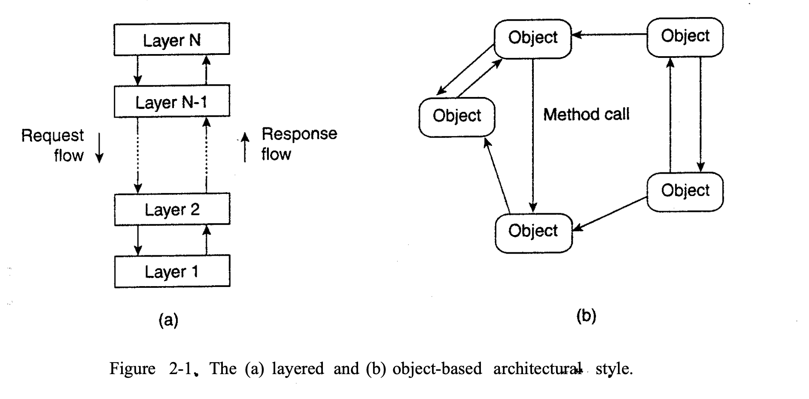
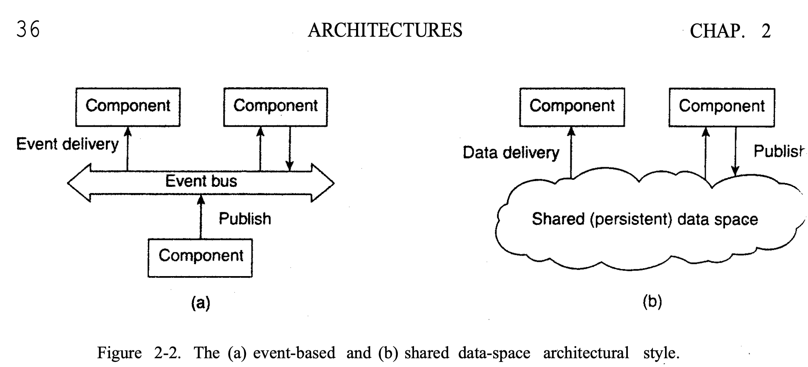
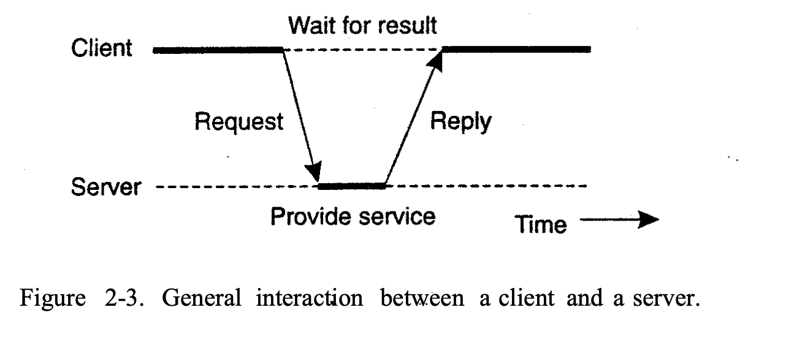
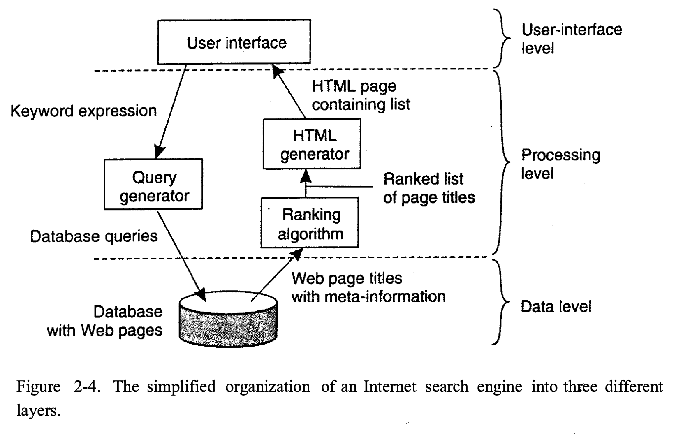
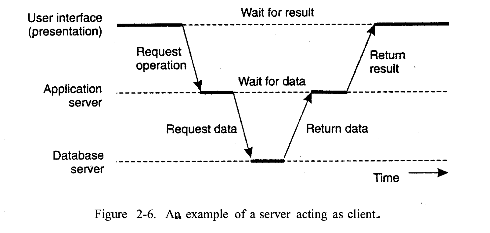
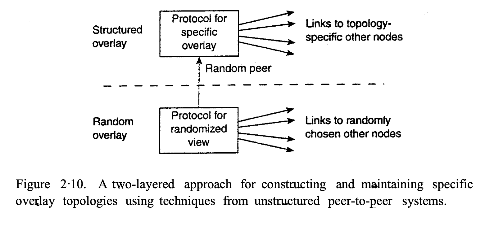
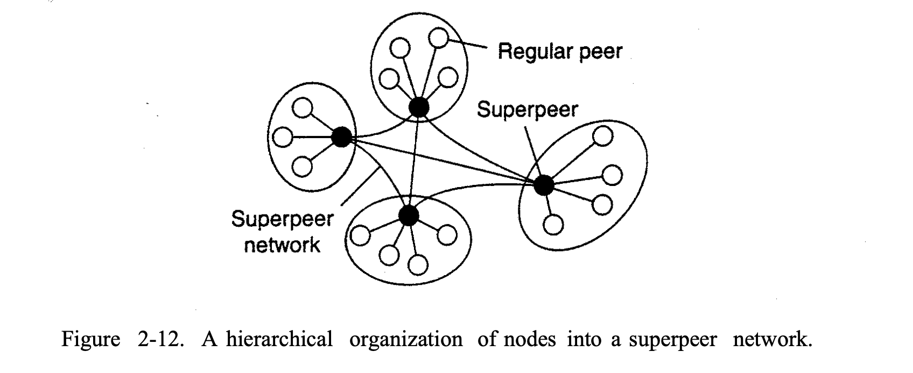
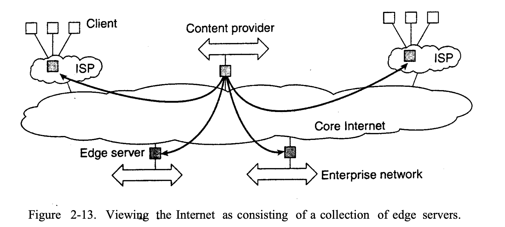
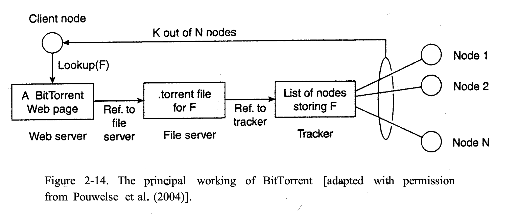
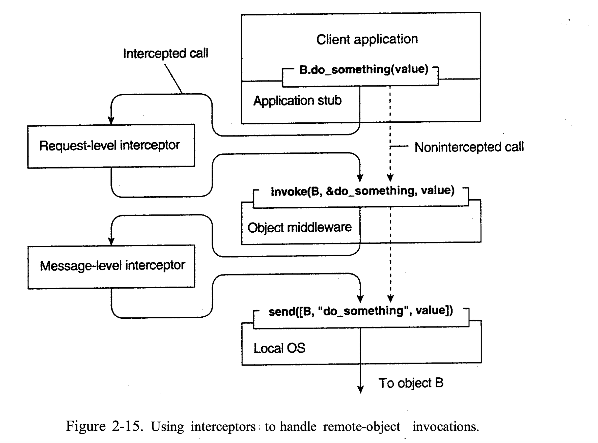

# Distributed System Architectures

We will first pay attention to some commonlly applied approaches toward organizing distributed systems.

## 1. ARCHITECTURAL STYLES

1. Layered architectures
2. Object-based architectures 
3. Data-centered architectures 
4. Event-based architectures

## 2. SYSTEM ARCHITECTURES

#### 2.1 Centralized Architectures

Application Layering：

1. The user-interface level
    - The user-interface level contains all that is necessary to directly interface with the user, such as display management. 
2. The processing level
    - The processing level typically contains the ap- plications.
3. The data level
    - The data level manages the actual data that is being acted on.

This is a a three-tiered architecture.

#### 2.2 Decentralized Architectures

1. Peer-to-Peer Architectures：
    - In a structured peer-to-peer architecture, the overlay network(Such as VPN) is constructed using a deterministic procedure. 

2. Unstructured Peer-to- Peer Architectures：
    - Unstructured peer-to-peer systems largely rely on randomized algorithms for constructing an overlay network.

3. Topology Management of Overlay Networks
    - The lowest layers of the overlay network are random overlay networks.
    - The higher layers of the overlay network are structured overlay networks.

4. Superpeers
    - In unstructured peer-to-peer systems, locating relevant data items is a challenge.

#### Hybrid Architectures

In this section we take a look at some specific classes of distributed systems in which client-server solutions are combined with decentralized architectures.

1. Edge-Server Systems
    - End users, or clients in general, connect to the Internet by means of an edge server. The edge server's main purpose is to serve content, possibly after applying filtering and transcoding functions.

2. Collaborative Distributed Systems
    - Collaborative distributed systems are characterized by the fact that the back-end is decentralized, but the client-server architecture is preserved.

#### 2.3 ARCHITECTURES VERSUS MIDDLEW ARE
A question that comes to mind is where middleware fits in.

##### 2.3.1 Interceptors
- By the layer by layer invocation of interceptors, the middleware can be handle the message by sparate as fragments and then integrate them into the lower layers.

##### 2.3.2 General Approaches to Adaptive Software
Three basic techniques to come to software adaptation:
1. Separation of concerns 
2. Computational reflection 
    - Computational reflection refers to the ability of a program to inspect itself and, if necessary, adapt its behavior
3. Component-based design
    - Component-based design supports adaptation through composition.
##### 2.3.3 Discussion

##### 2.3.4 Layered Architectures

