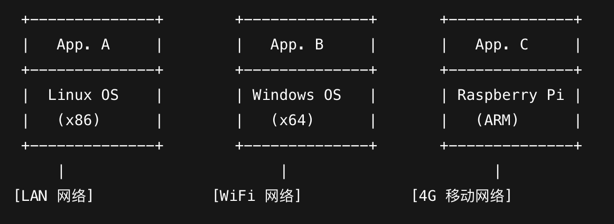
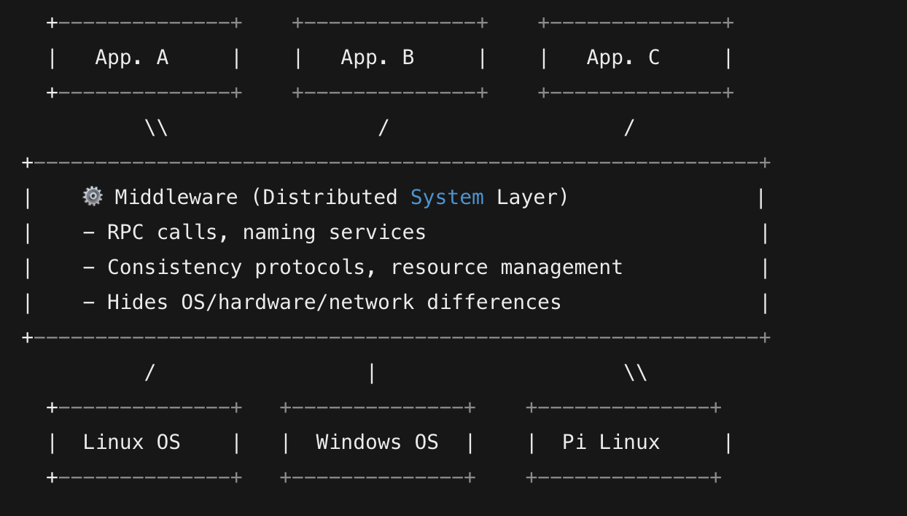

# Distributed System Basic

## What is a distributed system?

A distribute system is a collection of independent computers that appears to its users as a single coherent system.

## 1. Distributed System Introduction

The distribute system in order to supprot heterogeneous computers and networks. 

#### The heterogeneous computers and networks

In a distributed system, "heterogeneous" means that each machine, operating system, hardware architecture, and network type in the system may be different, for example:

- A server running Linux on x86 architecture

- A development machine running Windows

- A Raspberry Pi running ARM

- Some are connected to wired networks, some to WiFi, even 4G networks

`🎯 Problem arises...`

If you want these devices to collaborate on a task, direct development becomes extremely complex!

- Each system interface is different

- Network communication is incompatible

- There are significant differences in hardware performance

#### Middleware

Middleware is a software layer that allows different systems to communicate and collaborate. It provides a common interface for different systems to interact with each other, regardless of their underlying hardware or software.

So, the distributed system is a middleware that allows different systems to communicate and collaborate.

## Distributed System Goals

#### 1. Making Resources Accessible

Share resources and make them accessible to all the users. Such as print service, file service, etc.

#### 2. Distribution Transparency

Users use it without knowing the underlying physical location of the resources.

#### 3. Openness

An Open distributed system is one that offers a standard interface for users to access resources.

#### 4. Scalability

The capacity of a system too difficult to scale up when the number of users or the amount of data grows.

#### 5. Pitfalls

We need to consider the following pitfalls:
1. The network is reliable.
2. The network is secure.
3. The network is homogeneous.
4. The topology does not change.
5. Latency is zero.
6. Bandwidth is infinite.
7. Transport cost is zero.
8. There is one administrator.

## TYPES OF DISTRIBUTED SYSTEMS

#### Distributed Computing Systems
1. Cluster Computing Systems (homogeneity)
2. Grid Computing Systems (heterogeneity)
#### Distributed Information Systems
1. Transaction Processing Systems
2. Enterprise Application Integration
#### Distributed Pervasive Systems
1. Home Systems
2. Electronic Health Care Systems
3. Sensor Networks

## Summary

This chapter introduces the basic concepts of distributed systems.